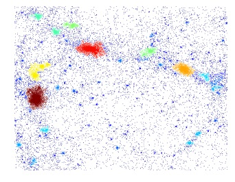

hfof
======

### Friends of Friends group finding via spatial hashing


hfof is an open-source friends-of-friends (FoF) group finder in 3d (periodic and non-periodic), based on the following paper: .

Once you have downloaded hfof you will probably want to do the following:

## Install

Build the C-functions with

```bash
make
```

Run the tests, e.g. with

```bash
nosetests tests/
```
(use `-v` verbose or `-vs` for really verbose)

Add hfof to your PYTHONPATH, perhaps in your .profile e.g.
```bash
PYTHONPATH="${PYTHONPATH}:${HOME}/codes/hfof"
export PYTHONPATH
```

## Examples
These probably need at least python 2.7 and a (non-ancient) numpy and scipy. 

### Labal an example set of particles with by their connectivity
    
In a python environment try
    
```python
from hfof import fof, example_data
import numpy as np

pos = example_data.get_pos() # (32768,3) positions in [0,1]
pos[:,2] *= 0.0 # project (squash) z-dimension
r_cut = 0.004 # linking length

fof_labels = fof(pos, r_cut, boxsize=1.0) # integer labels from 0...

# color by number of particles in group
clrs = np.bincount(fof_labels)[fof_labels]
import pylab as pl
pl.scatter(pos[:,0],pos[:,1], c=np.power(clrs,0.3), s=1.0, edgecolors='none')
pl.show()
```

All of these are equivalent to running

```
python examples/example1.py
```
